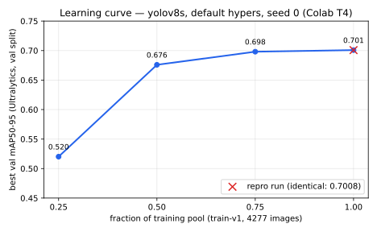

# Experiment 1 — Learning curve: is the model data-starved or capacity-limited?

- **Status:** COMPLETE
- **Date:** 2026-07-12
- **Phase:** 3 (mandatory experiment #1, guide §4/Phase 3.3)

## Question

With the sampled training pool (train-v1: 4,277 train / 861 val images), does yolov8s improve
with more data (data-starved → the flywheel should chase volume) or has it plateaued
(capacity-/task-limited → the flywheel must mine *harder/rarer* examples, not more of the
same)? This answer drives every later data decision.

## Method

Four runs, identical config (`configs/training/base.yaml`: yolov8s COCO-pretrained init,
default hyperparameters, imgsz 640, batch 16, seed 0), differing only in `fraction`
∈ {0.25, 0.5, 0.75, 1.0}. All on Colab T4 via the pinned `colab run` invocation (ADR 0009),
run names `lc-25`/`lc-50`/`lc-75`/`baseline`, all with full Law 6 provenance on DagsHub
MLflow (every run at git `668e42f`, dataset md5 `678cdd…`, seed 0). Early stopping: patience
20 on val mAP50-95; best-epoch checkpointing. `baseline` doubles as the 100% point and the
champion-v1 candidate. A fifth run, `baseline-repro` (same config, same seed), measures
run-to-run noise.

**Metric caveat (Law 2, stated plainly):** the curve plots Ultralytics **val mAP50-95 on
train-v1's val split** — the guide prescribes this for the study, and it is a *relative*
comparison between identically-measured runs, never a quotable accuracy claim. The quotable
number for the chosen champion comes from the frozen `eval-harness-v1.1` report attached to
its registry entry (`reports/champion-v1/`).

## Results

| fraction | images | best val mAP50-95 | best epoch | epochs run | wall time (T4) |
|---|---|---|---|---|---|
| 0.25 | ~1069 | 0.5202 | 4 | 25 | 12 min |
| 0.50 | ~2139 | 0.6759 | 25 | 46 | 38 min |
| 0.75 | ~3208 | 0.6981 | 31 | 52 | 63 min |
| 1.00 | 4277 | 0.7008 | 32 | 53 | 80 min |
| 1.00 (repro) | 4277 | **0.7008** | 32 | 53 | 84 min |

Increments: +0.156 (25→50%), +0.022 (50→75%), **+0.003 (75→100%)**.

**Reproducibility (exit criterion #1):** `baseline` vs `baseline-repro` — best val mAP50-95
identical to 4 decimal places (0.7008 vs 0.7008), same best epoch (32). Observed delta
< 0.0001. Documented tolerance for future same-config comparisons on this hardware class:
**±0.005** (conservative bound; the observed noise is far below it, but cross-session GPU
nondeterminism can exceed the observed zero).

## Conclusion

**Capacity-/task-limited on in-distribution data, saturating at ~75% of the pool.** The last
quartile of data buys +0.003 — an order of magnitude below the +0.156 the second quartile
bought, and below even the documented repro tolerance. Adding more *same-distribution* UA-DETRAC
frames is near-worthless.

Consequences for later phases:

- **The Phase 8 flywheel cannot justify itself on volume.** Its value must come from frames
  that shift the distribution — night/rain, unusual cameras, small/distant boxes (the harness
  scale-slice floor of 0.069 zero-shot shows where the headroom lives). This is exactly what
  the mining signals (low confidence, flicker, drift windows, teacher disagreement) select for,
  and the flywheel study (experiment #4) must be read against this baseline expectation.
- **Phase 4 tuning** operates in a saturated-data regime: gains, if any, come from
  optimization/augmentation, not from the model being starved.
- Training is cheap here (~80 min full-pool on T4, ~2.5 CU): re-training per flywheel cycle
  is not a bottleneck.
